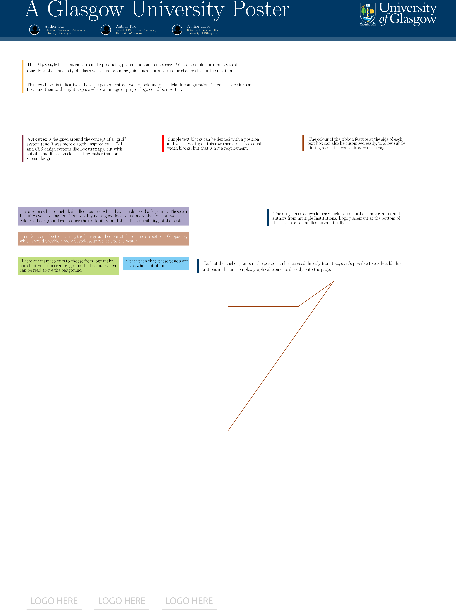

# University of Glasgow Poster Style for LaTeX

This is a LaTeX style-file for producing posters which approximately
conform to the University of Glasgow [branding
guidelines](https://www.gla.ac.uk/myglasgow/staff/brandguidelines/), while being fairly straight-forward to use.

A very simple usage example is included as `demo.tex`.

## Example



## Installation

The `guposter` class can be installed on Unix systems by downloading
the contents of this repository, and then running `make install`
inside the directory. If you're running another system (e.g. Windows),
or do not want a system-wide installation then you may find it easier
to simply copy the `guposter.cls` and `uofg_colour.tex` files into the
working directory of your poster.

Note that installation requires that you are on the University of
Glasgow network, or connected to it via VPN, in order to download the
main University logo. If you have this downloaded already you should
copy it into the repository, in pdf format, named `UoG_keyline.pdf`,
and the download stage will be skipped.

## Usage

Using the poster style doesn't require much new syntax beyond standard
LaTeX.

The `documentclass` should be set at the beginning of the `tex` file with 

```latex
\documentclass{guposter}
```

The title can be created in the preamble (before the `begin{document}`
line) with the `authors`, `title`, and `logos` commands:

### title
The title of the poster can be set using the `title` macro, e.g.
```latex
\title{A Glasgow University Poster}
```

### authors

The `authors` macro stores the information about each author of the poster, as a list of lists of the format
	`<NAME>,<INSTITUTION-DIVISION>,<INSTITUTION>,<PHOTO-FILE>`
with authors separated by semicolons, for example:
```latex
\authors{
  Author One, School of Physics and Astronomy, University of Glasgow, person.png;
  Author Two, School of Physics and Astronomy, University of Glasgow, person.png;
  Author Three, School of Somewhere Else, University of Otherplace, person.png
}
```
would produce a header with three authors.

### logos

The `logos` macro stores a list of logo files to include at the end of
the poster, e.g. for funding agency, institute, or collaboration
logos. These should be a list of file-names, separated by commas, for
example:
```latex
\logos{logo.png,logo.png,logo.png}
```

### maketitle

The title will not be produced until the `\maketitle` directive
appears in the file; you should do this immediately after the
`\begin{document}` line.


### The grid system

In order to place text blocks on the poster, `guposter` divides the
page into a grid of rows and columns; each column is assigned a number
between 0 and 12, while each row is given a letter from a to v. This
produces a grid of points which text blocks and graphical elements can
be attached to.

The grid can be displayed for drafting purposes by adding the
`\drawgrid` directive to your document (you may need to run your latex
compiler twice for this to work).

As well as working with the various elements provided by the
`guposter` class, each anchor point is also a `tikz` coordinate, so
arbitrary shapes can be drawn on the shape using the `tikzpicture`
environment, provided it is given the `remember picture` and `overlay`
options, for example:
```latex
  \begin{tikzpicture}[remember picture, overlay]
    \draw [ultra thick, university-rust] (k6) -- (k8) -- (j9) -- (p6);
  \end{tikzpicture}
```

### Panels

The current version of `guposter` provides three distinct graphical
environments, `abstract`, designed for the abstract at the top of the
poster, `panel`, designed for the majority of text boxes on the
poster, and `fillpanel`, for panels with a background colour. These
all have a similar syntax:
```latex
\begin{panel}{<TOP-LEFT-CORNER>}{<WIDTH>}[<RIBBON_COLOUR>]
	Some text goes here.
 \end{panel}
 ```
The first argument is the name of the anchor point where the top
left-hand corner of the block should be placed, e.g. `a5`. The second
is the width, in columns, of the block, and the (optional) third
argument is the colour that the vertical line on the left of the block
should be.

An example of such an environment is
```latex
 \begin{panel}{d8}{3}[university-rust]
   {\Large The colour of the ribbon feature at the side of each text
     box can also be cusomised easily, to allow subtle hinting at
     related concepts across the page.}
 \end{panel}
```

The `fillpanel` environment can also take an optional fourth argument,
to determine the colour of the internal text, e.g.
```latex
 \begin{fillpanel}{g0}{5}[university-lavendar][black]
   It's also possible to included ``filled'' panels, which have a
   coloured background. These can be quite eye-catching, but it's
   probably not a good idea to use more than one or two, as the
   coloured background can reduce the readability (and thus the
   accessibility) of the poster.
 \end{fillpanel}
 ```
 
### Colours
All of the colours from the University branding guidelines are
available, prefixed with the word `university`. For example, the main
blue colour used in university publications has been called
`university-blue`, while the "rust" colour becomes
`university-rust`. The full list of colours can be found in the
`uofg_colour.tex` file, or on the University's website. Other colours
defined in the `xcolor` package can also be used.

## Credits
The "person" icon, used in place of photographs in the demo file is
licensed under the Creative Commons Attribution-Share Alike 3.0
Unported license, and was created for Font Awesome by Dave Gandy –
http://fontawesome.io.
